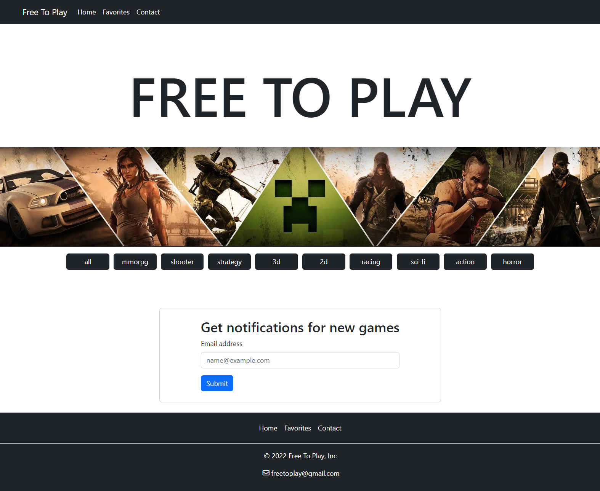
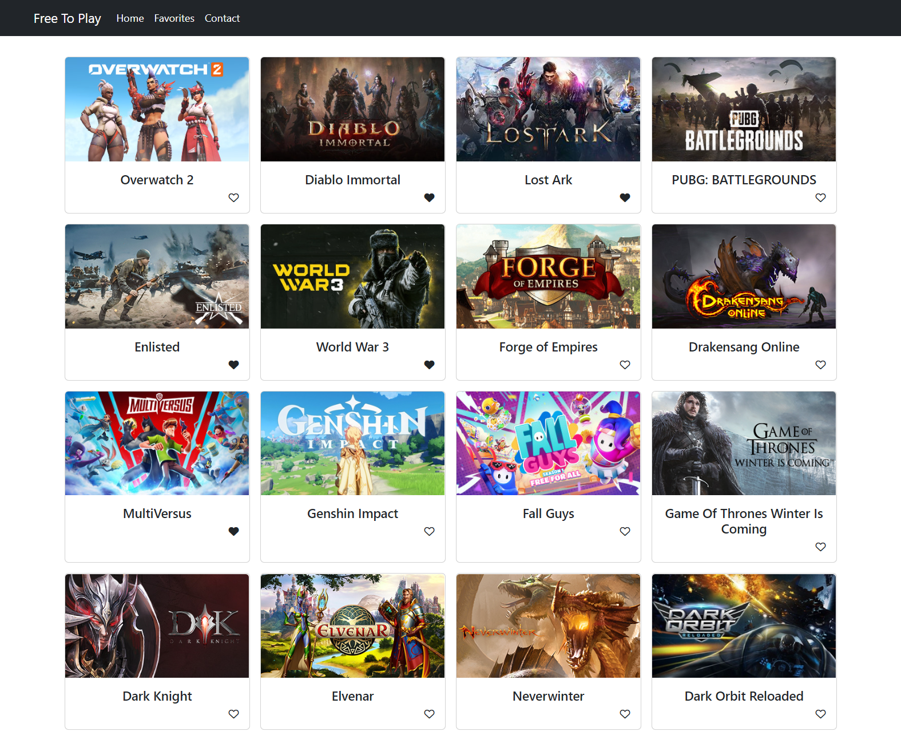
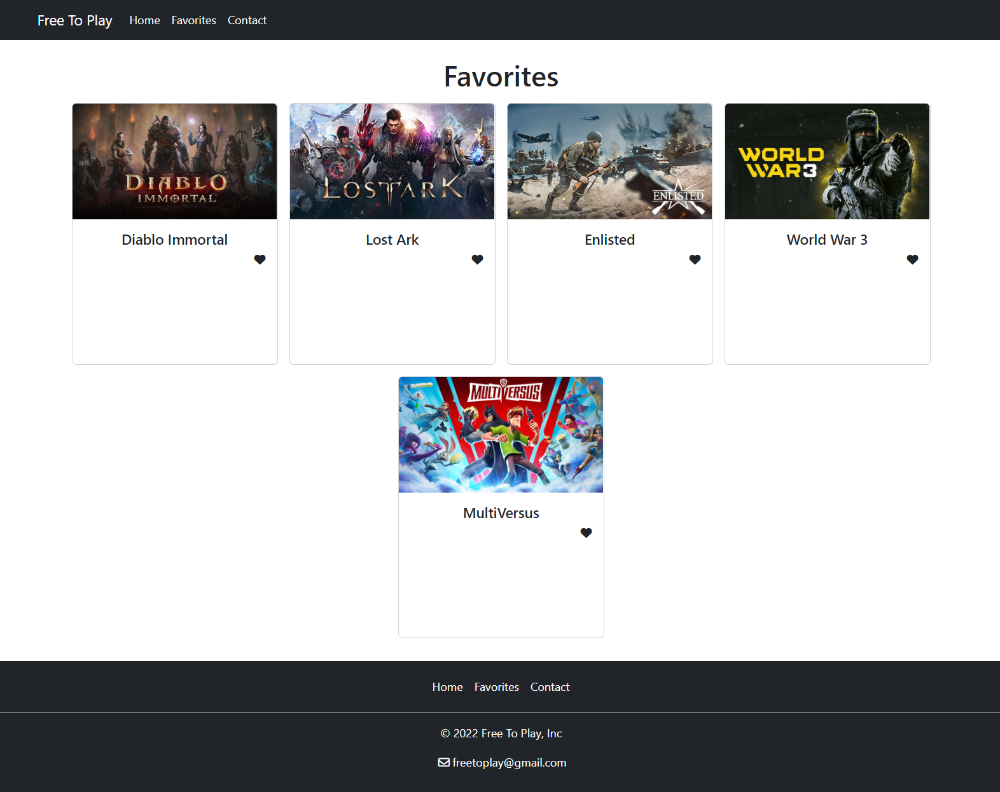
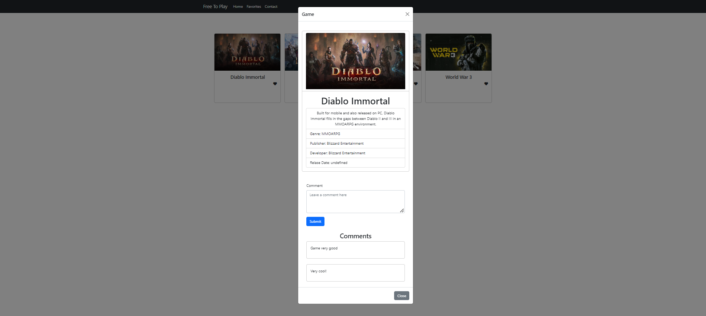
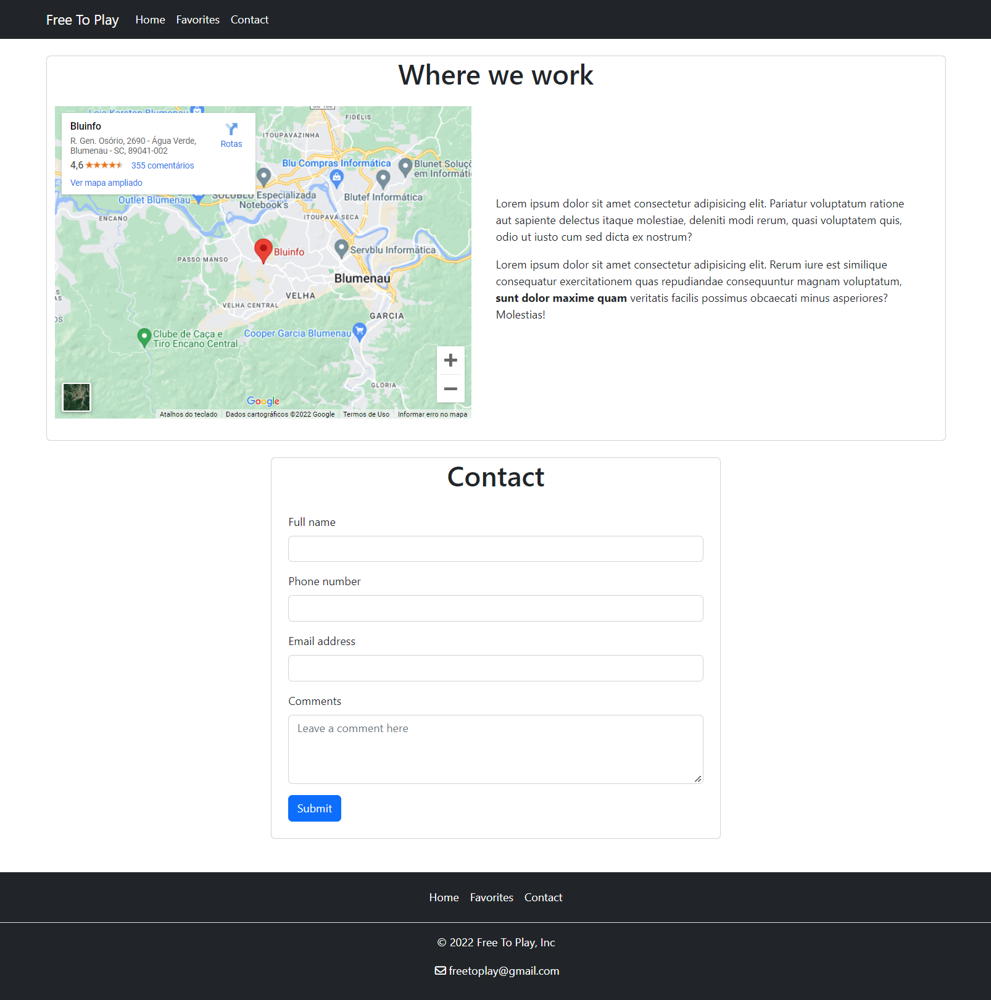

# FREE TO PLAY - Projeto API +Devs2Blu

## API utilizada
[Free-to-Play Games Database](https://rapidapi.com/digiwalls/api/free-to-play-games-database/)
> Obs: a API precisa de uma chave de acesso para funcionar.

## Páginas

### Página home

## Página de conteúdo

## Página de favoritos

## Modal com detalhes do jogo

## Página de contato

